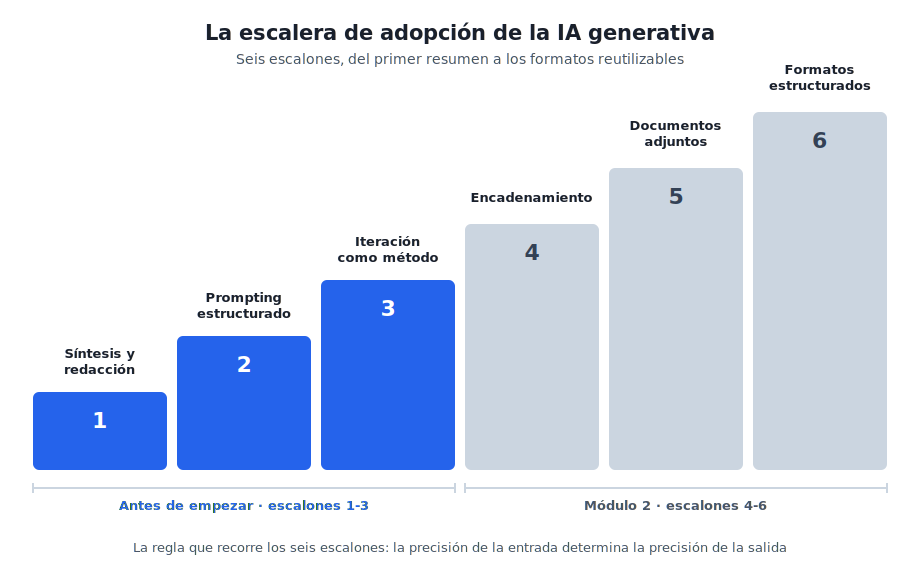

# Antes de empezar

## Los tres primeros escalones, con el chat que ya tienes

Este capítulo es para ti si alguna vez has abierto ChatGPT, has recibido una respuesta mediocre y has concluido que esto no era para tanto. La causa de esa decepción suele estar en cómo se pide, y aprender a pedir bien tiene tres pasos concretos que cualquiera puede dar en una tarde. Yo tardé dos años en interiorizarlos por la vía lenta, probando y fallando; este capítulo existe para ahorrarte ese rodeo.

Aquí no hace falta instalar nada, crear ninguna cuenta nueva ni tocar ninguna herramienta que no tengas ya. Todo se practica con el chat de IA que ya conoces (ChatGPT, Claude o Gemini, cualquiera vale) y con material tuyo. Los conceptos, las herramientas y las decisiones de fondo llegan a partir del módulo 1; antes conviene dominar la base sobre la que se apoya todo lo demás.

---

## 1. La escalera: el mapa del curso entero

Mi propio recorrido con estas herramientas, de 2023 a hoy, siguió una secuencia que se puede dibujar como una escalera de seis escalones. Empecé pidiendo resúmenes sueltos, aprendí a estructurar las peticiones, descubrí que la primera respuesta es siempre un borrador, y solo después llegaron los pasos encadenados, los documentos adjuntos y los formatos reutilizables. La secuencia es reproducible, y este curso la recorre entera.

Este capítulo cubre los escalones 1 a 3, que se suben solo con el chat. Los escalones 4 a 6 (encadenar pasos, trabajar sobre tus documentos, pedir formatos reutilizables) se suben en el [módulo 2](modulo-2-automatizar-con-ia.md). Entre unos y otros está el descansillo del dibujo: el [módulo 1](modulo-1-entender-ia-generativa.md), que no es un escalón de práctica sino los conceptos para decidir con criterio (qué es la IA, qué modelo elegir, qué compartir con ella y cuánto cuesta). Para un principiante, la mayor parte del valor está en los tres primeros escalones: con ellos ya se trabaja distinto.

> [!tip] Observación práctica
> No hace falta memorizar la escalera ni subirla de un tirón. Sirve para situarte: cuando una sección del curso te resulte avanzada, casi siempre será porque presupone un escalón que aún no has practicado. Vuelve a él y el resto encaja.

---

## 2. Escalón 1: pedirle trabajo, no respuestas

La mayoría de la gente usa el chat de IA como un buscador con frases largas: le hace preguntas y lee respuestas. Ese uso decepciona pronto, porque para preguntas generales ya existe el buscador de toda la vida. El cambio de chip del primer escalón es darle **trabajo sobre tu material**: resumir un documento largo, extraer los datos concretos de un texto, redactar un primer borrador a partir de tus notas.

Mis primeras conversaciones útiles, allá por 2023, fueron exactamente eso: pegar un documento extenso y pedir lo esencial, o pasar unas notas desordenadas y pedir un borrador decente. Sin más sofisticación, ese uso ya devuelve la inversión de tiempo, porque convierte horas de lectura y redacción mecánica en minutos de revisión.

Una petición de primer escalón se parece a esto:

> "Resume el texto siguiente en cinco puntos, pensando en alguien que tiene dos minutos para leerlos. Texto: [pegas aquí el documento]"

Fíjate en que la instrucción que escribes tiene nombre propio: se llama **prompt**, así la llama todo el mundo y así la recoge el [glosario](glosario.md). De momento basta con saber que un buen prompt dice qué quieres, sobre qué material y para quién.

> [!example] Ejercicio 1
> Elige un documento tuyo de verdad: un informe que tengas pendiente de leer, un acta larga, una cadena de correos interminable. Pégalo en el chat y pide un resumen en cinco puntos para un lector concreto (tu jefe, tu equipo, tú mismo dentro de un mes). Compara el resultado con lo que tú habrías subrayado. Ahí verás, en tu propio material, qué hace bien y qué se le escapa.

> [!warning] Aviso antes de pegar nada
> Para estos ejercicios usa material sin datos sensibles: documentos públicos, textos propios o material anonimizado (quita nombres, cifras de clientes y cualquier dato personal). La regla completa de qué se puede compartir con la IA y qué no llega en el módulo 1; hasta entonces, en caso de duda, no lo pegues.

---

## 3. Escalón 2: la instrucción estructurada

El salto de calidad más grande de toda la escalera cuesta una frase más de escritura. Una petición suelta ("resume esto") produce resultados genéricos; una petición estructurada produce resultados que parecen de otra herramienta, cuando lo único que ha cambiado es la entrada. La estructura tiene cinco piezas:

- **Rol**: quién quieres que sea. "Eres un asesor que prepara resúmenes para un comité de dirección."
- **Tarea**: qué tiene que hacer, en una frase.
- **Contexto**: lo que necesita saber y no está en el texto. "El cliente está molesto por el retraso del mes pasado."
- **Formato**: cómo quieres la salida. "Un correo de cuatro párrafos", "una tabla con tres columnas".
- **Restricciones**: los límites. "Máximo 200 palabras", "tono firme pero cordial", "si falta algún dato, dilo en vez de inventarlo".

En mi histórico, el salto del primer año al segundo se ve exactamente aquí. Un ejemplo que recuerdo bien: un discurso para una conferencia con un hueco de nueve a diez minutos. En vez de pedir "escríbeme un discurso", la petición fijaba el papel del ponente, el público, el mensaje central y una restricción dura de duración (a unas dos palabras y media por segundo, el texto no podía pasar de cierta longitud). El resultado necesitó retoques, por supuesto, pero salió a la primera con la medida y el tono correctos, porque la medida y el tono iban en la petición.

> [!tip] Observación práctica
> La pieza que más gente omite es la última: qué hacer si falta información. Sin esa instrucción, la IA rellena los huecos con inventos que suenan verosímiles. Añadir "si no tienes el dato, indícalo" a tus peticiones es el hábito más rentable de este capítulo, y en el [módulo 1](modulo-1-entender-ia-generativa.md) verás por qué (la trampa se llama precisión plausible).

> [!example] Ejercicio 2
> Coge un correo real que tengas pendiente de escribir y que te dé pereza: una respuesta delicada, una reclamación, una negativa. Pídeselo al chat con las cinco piezas: rol, tarea, contexto, formato y restricciones. Lee el borrador como lo que es, un borrador, y quédate con lo aprovechable. El objetivo del ejercicio es comprobar cuánto mejora la salida cuando la entrada va completa.

---

## 4. Escalón 3: la primera respuesta es un borrador

Aquí está la diferencia entre quien abandona y quien avanza. Quien abandona trata la primera respuesta como un veredicto: si sale mediocre, la herramienta no vale. Quien avanza la trata como un primer borrador y responde con crítica concreta: qué sobra, qué falta, qué está mal enfocado. La herramienta encaja esa crítica sin agotarse, las veces que haga falta.

Un caso mío, de cuando preparaba un artículo: necesitaba una pieza visual que explicara los beneficios de una metodología de trabajo. La primera propuesta era confusa; la segunda, mejor pero recargada; en cada vuelta yo explicaba qué fallaba exactamente, y a la cuarta iteración quedó claro que aquel contenido funcionaba mejor como tabla que como gráfico. Cambiamos de formato y la tabla acabó en el artículo. La iteración incluye eso: saber pedir un formato distinto cuando el elegido no funciona.

Dos peticiones de iteración que uso constantemente:

> "Demasiado genérico. El lector es [quien sea] y le importa sobre todo [lo que sea]. Reescribe con eso en mente."

> "Tu respuesta me da la razón en todo, y eso me sirve de poco. Dame los tres argumentos en contra más fuertes."

La segunda merece comentario: estas herramientas son complacientes por diseño, y pedirles explícitamente el ángulo contrario es la forma más rápida de obtener un análisis con sustancia en lugar de un eco de tu propia opinión.

> [!example] Ejercicio 3
> Recupera una conversación en la que la IA te decepcionó (o provoca una nueva con una petición floja a propósito). Itera tres veces, y en cada vuelta señala un fallo concreto: una vez el enfoque, otra el tono o el público, otra el formato. Si a la tercera iteración el resultado no es claramente mejor que el inicial, revisa qué le estás dando: casi siempre falta contexto, no capacidad.

---

## 5. El principio que gobierna los tres escalones

Si solo te llevas una idea de este capítulo, que sea esta: **la precisión de la entrada determina la precisión de la salida**. Cuando la respuesta es genérica, la causa suele estar en la pregunta; cuando inventa, suele ser porque le pediste recordar en vez de darle el material; cuando se equivoca de tono, casi nunca le dijiste para quién escribía. La IA solo sabe lo que le pones delante.

Esto, que dicho así parece evidente, es lo que más tardé en interiorizar de todo mi recorrido. Durante meses atribuí al modelo limitaciones que eran de mis peticiones, y el día que empecé a revisar la entrada antes de culpar a la salida, la herramienta entera cambió de categoría. Los tres escalones de este capítulo son, en el fondo, tres formas de aplicar el mismo principio.

---

## 6. Si tienes dudas

Las preguntas que siguen son las que más oigo de colegas de mi generación, y merecen respuesta directa.

**"Tengo 55 años, ¿de verdad puedo aprender esto?"** Los tres escalones de este capítulo no exigen ninguna destreza técnica nueva: exigen escribir con claridad y juzgar resultados, que es lo que llevas haciendo toda tu carrera. La ventaja en este terreno la da el criterio acumulado, porque la IA redacta rápido pero decidir si el resultado vale exige conocer el oficio, y eso no se aprende en seis meses de ChatGPT. Tu experiencia juega a favor, con una condición: practicar sobre material propio, que es justo lo que piden los ejercicios.

**"¿Me quedo sin trabajo?"** Nadie puede prometerte que no, y desconfía de quien lo haga en cualquiera de los dos sentidos. Lo observable hoy es que cambian las tareas: lo mecánico (resumir, extraer, redactar primeras versiones) se delega, y la revisión con criterio vale más que antes, porque alguien tiene que responder de lo que se entrega. El riesgo más concreto a corto plazo tiene otra forma: competir con alguien de tu mismo perfil que ya delega lo tedioso y dedica las horas ganadas a lo que de verdad se paga.

**"Mi empresa prohíbe subir datos a la nube."** Prudente por su parte, y compatible con este curso. Para aprender no hace falta tocar ni un dato de la empresa: los ejercicios funcionan con documentos públicos, material inventado o textos anonimizados. En el módulo 1 verás la regla completa de qué se puede compartir, las opciones que no salen de tu ordenador y cómo plantear la conversación con el responsable de informática, que suele ser más receptiva de lo que se espera cuando llegas con el vocabulario correcto.

**"Ya lo probé y me decepcionó."** Lo esperable, si la entrada fue una petición suelta de una línea. La respuesta mediocre ante una entrada pobre es el comportamiento normal de estas herramientas, y los escalones 2 y 3 existen precisamente para eso. Antes de dar el veredicto definitivo, concédele los tres ejercicios de este capítulo con material tuyo; el juicio que emitas después será informado, sea cual sea.

---

## 7. Cierre y aprendizajes clave

- **La escalera de seis escalones es el mapa del curso**: este capítulo sube los tres primeros y el módulo 2 retoma los otros tres.
- **Escalón 1**: la IA rinde cuando le das trabajo sobre tu material, en vez de hacerle preguntas de cultura general.
- **Escalón 2**: rol, tarea, contexto, formato y restricciones convierten una petición floja en una instrucción profesional.
- **Escalón 3**: la primera respuesta es un borrador; la crítica concreta y la petición de contraargumentos son las herramientas de mejora.
- **El principio de fondo**: la precisión de la entrada determina la precisión de la salida.

> [!abstract] Resumen del capítulo
> Ya sabes pedir trabajo útil con el chat que tenías: resumir y redactar sobre material propio, estructurar la instrucción completa e iterar con criterio. Con esa base, el módulo 1 te da los conceptos para decidir qué herramienta usar, qué compartir con ella y cuánto cuesta.

---

Con los tres primeros escalones practicados, sigue en el [Módulo 1](modulo-1-entender-ia-generativa.md): entender qué hay detrás de estas herramientas, elegir modelo con criterio y proteger tu información.
