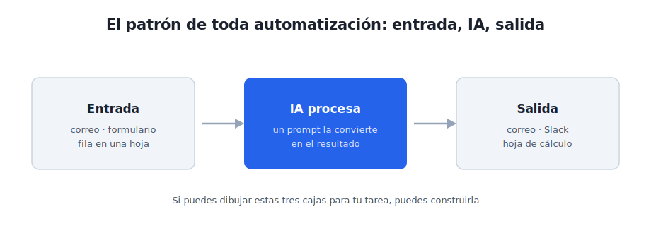
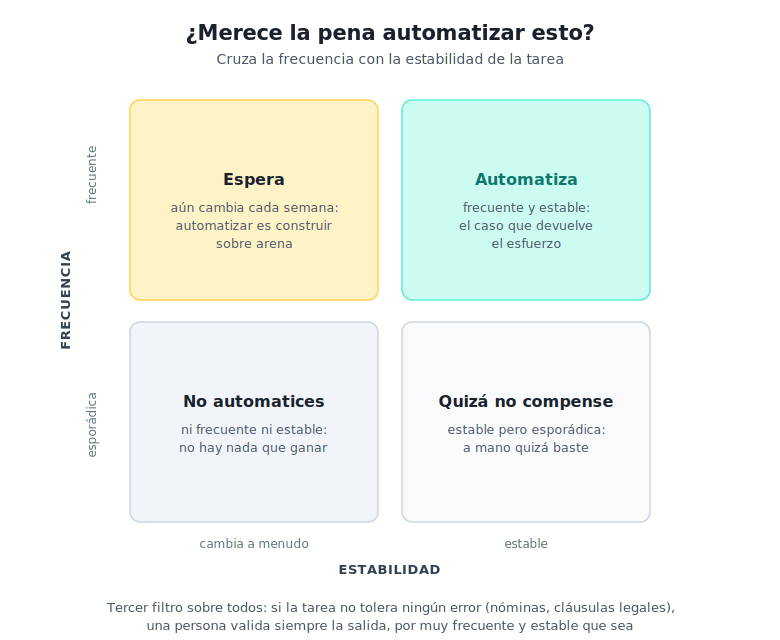

# Módulo 2 - Encadenar y adjuntar antes que automatizar

## Los tres escalones que faltan, y luego tu primer flujo

En [Antes de empezar](antes-de-empezar.md) subiste los tres primeros escalones de la escalera: pedir trabajo, estructurar la instrucción, iterar. En el [módulo 1](modulo-1-entender-ia-generativa.md) te paraste en el descansillo de los conceptos. Ahora retomamos la escalera por donde la dejaste.

Casi todo el mundo, y casi todos los cursos, dan aquí un salto demasiado largo: pasan de escribir prompts sueltos a montar automatizaciones complejas, y por el camino se saltan tres habilidades que se practican todavía con el chat que ya tienes. Este módulo recorre primero esos tres escalones (encadenar pasos, adjuntar documentos, pedir formatos reutilizables) y solo después monta una automatización de verdad, una sola, de principio a fin. Si haces la primera mitad con calma, la segunda se entiende sin esfuerzo.

---

## Primera mitad: los escalones 4, 5 y 6

### 1. Escalón 4: encadenar pasos

Hasta ahora cada petición ha sido un acto único: preguntas, recibes, listo. El cuarto escalón es darse cuenta de que una tarea grande se hace mejor en dos o tres pasos seguidos, donde la salida de uno alimenta al siguiente. No es una técnica nueva de la IA: es cómo trabajas tú ya, partiendo lo complejo en piezas manejables.

Un ejemplo de mi propio trabajo: preparar una presentación a partir de un documento denso. En vez de pedir "hazme una presentación de este informe" (que da un resultado plano), encadeno tres pasos:

1. **Primero, extraer**: "Saca de este informe los cinco mensajes principales, uno por línea."
2. **Después, ordenar**: "Con esos cinco mensajes, propón un guion de presentación de seis diapositivas, con el título de cada una."
3. **Por último, redactar**: "Desarrolla la diapositiva 3 en tres viñetas para un público directivo."

Cada paso es corto, revisable y corregible antes de seguir. Si el guion del paso 2 no convence, lo arreglas ahí, sin haber gastado esfuerzo en redactar diapositivas que ibas a tirar. Encadenar es, sobre todo, una forma de mantener el control: revisas en cada juntura en vez de juzgar un bloque final que ya no sabes por dónde coger.

> [!tip] Observación práctica
> La señal de que una tarea pide encadenamiento es esta: si el resultado de un solo prompt sale confuso o genérico por más que afines la instrucción, casi siempre es porque le pides demasiados saltos de una vez. Pártelo. Dos prompts claros baten a uno enrevesado.

> [!example] Ejercicio 1
> Coge una tarea tuya de dos pasos naturales: un informe que resumir y luego convertir en correo, unas notas que ordenar y luego redactar. Hazla en el chat en dos peticiones encadenadas, revisando la primera salida antes de pedir la segunda. Compara con lo que sale al pedirlo todo de golpe. La diferencia es el escalón.

---

### 2. Escalón 5: adjuntar documentos

Los chats de IA actuales aceptan que les subas un archivo (un PDF, un Word, una hoja de cálculo, la foto de un documento) y respondan sobre su contenido. Es el quinto escalón, y cambia la relación con la herramienta: dejas de copiar y pegar fragmentos y le das el documento entero para que trabaje sobre él.

Yo lo hago desde mis primeras semanas con estas herramientas: subir un pliego largo y pedir el resumen de alcance, plazos y entregables; pasar un artículo y pedir los tres argumentos centrales; adjuntar una hoja con datos y pedir que señale lo que se sale de lo normal. La mecánica es la misma del escalón 1 (pedir trabajo sobre tu material), pero ahora el material es un archivo completo, no un texto pegado.

Aquí reaparece, con más fuerza, el hábito del módulo 1: **que copie, no que recuerde**. Cuando trabajes sobre un documento adjunto, pide explícitamente que extraiga del texto y que diga "no está en el documento" cuando algo falte. Sin esa instrucción, la IA mezcla lo que lee con lo que cree saber, y ahí vuelve la trampa de la precisión plausible.

> [!warning] Alerta de privacidad
> Adjuntar un documento es subirlo al proveedor. Antes de hacerlo, pasa el archivo por las tres preguntas del [módulo 1](modulo-1-entender-ia-generativa.md): ¿tiene datos personales o de terceros? ¿está bajo confidencialidad? ¿lo enviarías por un canal que no controlas? Si alguna falla, no lo subas, o usa una versión anonimizada o un modelo local.

> [!example] Ejercicio 2
> Elige un documento tuyo sin datos sensibles (un informe público, un texto propio, un material anonimizado). Súbelo al chat y pídele que extraiga una lista concreta: los plazos, las cifras clave, los puntos de acción. Añade la instrucción "si algo no está en el documento, dilo en vez de suponerlo". Comprueba si respeta esa frontera.

---

### 3. Escalón 6: pedir formatos reutilizables

El sexto escalón es el más sencillo de enunciar y el que más tiempo ahorra a la larga: pedir la salida en un formato que puedas reutilizar tal cual. Una tabla con columnas nombradas, una lista numerada, un esquema con apartados fijos. En vez de un párrafo que tienes que reordenar a mano, recibes algo que ya encaja donde va.

Es un patrón que uso de forma constante: pedir los riesgos de un proyecto como tabla de tres columnas (riesgo, impacto, mitigación), o las acciones de una reunión como lista con responsable y fecha. El valor no está solo en la primera vez. Cuando defines un formato y lo repites, todas tus salidas quedan comparables entre sí, y eso es justo lo que necesita una automatización: una forma de respuesta previsible que otra persona o un sistema puedan consumir sin reinterpretar.

Ese detalle conecta las dos mitades del módulo. **Los formatos estructurados son el puente hacia la automatización**, porque un flujo automático necesita que la IA responda siempre con la misma forma. Lo que en el chat es comodidad, en un flujo es requisito.

> [!example] Ejercicio 3
> Repite el ejercicio anterior, pero esta vez fija el formato: "Devuélvelo como tabla con las columnas Tema, Detalle y Acción." Guarda esa instrucción. La próxima vez que tengas un documento parecido, reutiliza el mismo formato y verás que las dos salidas se pueden comparar línea a línea. Esa repetibilidad es lo que hace automatizable una tarea.

---

## Segunda mitad: tu primer flujo automatizado

Con los seis escalones practicados, ya tienes lo que hace falta para dar el paso que la mayoría quiere ver desde el principio: **un flujo que procesa información con IA sin que tú estés delante**. Aquí cambia una cosa respecto a todo lo anterior: hasta ahora tú escribías cada petición; a partir de ahora el flujo la lanza solo, cuando se cumple un disparador.

Para que no quede abstracto, parto de un flujo real, uno de los primeros que monté para mí mismo: cada mañana lee varios boletines y alertas de noticias, descarta el ruido, puntúa lo que tiene que ver con infraestructuras y me deja un resumen ordenado en el correo antes de desayunar. Entrada (los boletines), IA (filtra y puntúa), salida (el correo). Ese es todo el secreto, y es lo que vas a ver montado paso a paso.

---

### 4. El patrón entrada → IA → salida

Casi toda automatización con IA se reduce a tres bloques encadenados:

1. **Entrada**: lo que llega y dispara el flujo. Un correo, un formulario, una fila nueva en una hoja, una hora del día.
2. **Procesamiento con IA**: el modelo recibe ese contenido con un prompt fijo y devuelve un resultado.
3. **Salida**: el resultado se envía a un canal (correo, Slack, Teams), se guarda en una hoja o se anota en otra herramienta.

Las herramientas visuales que verás enseguida sirven para conectar estos tres bloques sin escribir código: arrastras cajas y las unes con flechas. El patrón es siempre el mismo; lo único que cambia entre un flujo y otro son las piezas que metes en cada caja.

**Ejemplos por sector**, todos con la misma estructura de tres cajas:

- **Consultoría**: correo largo del cliente (entrada) → la IA lo resume en cinco puntos (proceso) → llega al canal del equipo (salida).
- **Ventas**: formulario de contacto web → la IA clasifica si es consulta, presupuesto o queja → se deriva al departamento correcto.
- **Operaciones**: informe mensual de un proveedor → la IA extrae riesgos y desviaciones → se guarda en la hoja de seguimiento.
- **RRHH**: candidatura recibida → la IA extrae la experiencia clave y la compara con el perfil → resumen para el responsable.

---

### 5. El flujo real, paso a paso, en Latenode

Voy a montar el flujo de los boletines en **Latenode**, que es la plataforma con la que construí el mío. Hay otras equivalentes (las verás en la tabla del apartado siguiente); elijo esta porque es la que de verdad uso, y prefiero enseñarte algo que funciona en mi cuenta a describir una pantalla genérica. Los nombres de los botones cambian de una plataforma a otra, pero los pasos son los mismos en todas.

#### Paso 1: el disparador

Lo primero es decidir qué pone en marcha el flujo. En este caso es la hora: "cada día a las 7:00". En otros flujos el disparador será "cuando llegue un correo" o "cuando se rellene un formulario". Estás diciendo: cuando ocurra esto, arranca.

> [JC: captura pendiente. Panel de Latenode con el nodo disparador configurado a las 7:00, mostrando el selector de programación horaria. Fechar la captura.]

#### Paso 2: traer el contenido

El segundo bloque recoge los boletines de la mañana: lee los correos de las fuentes que me interesan y junta su texto. Es el equivalente a abrir tú esos correos, solo que lo hace el flujo. Conviene una comprobación: si esa mañana no ha llegado nada, no tiene sentido seguir, así que el flujo se detiene ahí en lugar de llamar a la IA con las manos vacías.

> [JC: captura pendiente. Nodo de lectura de correos o fuentes, con el resultado de una ejecución mostrando los boletines recogidos. Anonimizar remitentes si aparecen.]

#### Paso 3: la llamada a la IA

El tercer bloque es el corazón del flujo. Usa el nodo de IA de la plataforma, que necesita dos cosas: tu **credencial** (la API key del módulo 1, pegada una vez en la configuración) y un **prompt fijo**. El prompt es el de siempre, con rol, tarea, formato y restricciones, solo que aquí no lo escribes cada día: lo escribes una vez y el flujo lo reutiliza. El mío dice, en esencia:

> "Eres un analista que filtra noticias de infraestructuras. De los boletines siguientes, descarta lo irrelevante y devuélveme los temas que importan, puntuados del 1 al 5 por relevancia, en una lista breve con una línea de explicación cada uno. Si no hay nada relevante, dilo. Boletines: {{contenido recogido}}"

> [JC: captura pendiente. Nodo de IA con el prompt fijo a la vista y el campo de credencial (la clave oculta). Mostrar dónde se inserta la variable con el contenido del paso 2.]

#### Paso 4: la salida al correo

El último bloque coge lo que devolvió la IA y me lo manda por correo. Aquí solo conectas el resultado del paso anterior con el campo del mensaje. Si tu organización usa Slack o Teams, el bloque de salida sería ese en vez del correo; la lógica no cambia.

> [JC: captura pendiente. Nodo de envío de correo con el cuerpo enlazado a la salida de la IA, y ejemplo del correo recibido en la bandeja. Anonimizar.]

#### Paso 5: la prueba

Antes de dejarlo corriendo solo, se ejecuta una vez a mano con el contenido real de un día y se comprueba dos cosas: que la IA responde con el formato pedido y que el correo llega donde debe. Si las dos salen bien, ya puedes activarlo y olvidarte; el flujo se ocupa cada mañana.

> [!tip] La calidad está en el prompt, no en la plataforma
> Una vez montado el esqueleto, lo que decide si el resultado sirve es el prompt, no la herramienta. Un prompt genérico ("resume esto") da resultados genéricos por muy buena que sea la plataforma. El que dice quién leerá el resultado, en qué formato y qué priorizar es el que devuelve algo útil. Toda la primera mitad de este módulo trabajaba para este momento.

---

### 6. Latenode, n8n, Make: cuál elegir

No hay una plataforma "correcta". Las tres más accesibles para empezar funcionan con el mismo patrón de cajas y flechas; se diferencian en el precio, la curva de entrada y lo que ya usa tu organización.

| Plataforma | Punto fuerte | A tener en cuenta |
|-----------|--------------|-------------------|
| **Latenode** | Nodo de IA integrado, interfaz directa; con la que monté mi flujo real | Plataforma más reciente, comunidad menor que n8n |
| **n8n** | Open-source, se puede alojar en tu propio servidor, comunidad amplia | Más opciones implica más que aprender al principio |
| **Make** | Muy visual, gran catálogo de conexiones a otras herramientas | El plan gratuito se queda corto en cuanto el flujo crece |

> [!tip] Observación práctica
> Para un primer flujo, elige la que te resulte menos intimidante al abrirla, no la "más potente". El primer flujo que funciona enseña más que tres tutoriales de la herramienta teóricamente mejor. Cambiar de plataforma después, cuando ya entiendes el patrón, cuesta poco.

**El coste, en orden de magnitud.** Estas plataformas tienen un plan gratuito que basta para uno o dos flujos personales, y planes de pago que arrancan en torno a 20-25 dólares al mes cuando automatizas en serio. A eso se suman los céntimos por uso de la IA que viste en el módulo 1: un flujo como el de los boletines, que corre una vez al día, se mueve en pocos euros al mes entre plataforma y modelo.

---

### 7. ¿Merece la pena automatizar esto?

Antes de montar nada, conviene pasar la idea por un filtro, porque automatizar tiene un coste de montaje y mantenimiento que no toda tarea justifica. El criterio cruza dos ejes (con qué frecuencia ocurre la tarea y cómo de estable es) y añade un tercer filtro sobre todo lo demás.

- **Frecuencia.** Una tarea que haces una vez al trimestre rara vez devuelve el esfuerzo de automatizarla. La que repites cada día o cada semana, sí.
- **Estabilidad.** Si el proceso cambia cada poco (otro formato, otro destinatario, otra regla), automatizarlo es construir sobre arena: pasarás más tiempo arreglando el flujo que el que ahorras.
- **Tolerancia al error.** Es el filtro que está por encima de los otros dos. La IA acierta mucho, aunque no siempre. En tareas que no toleran ningún fallo (nóminas, cláusulas legales firmes, comunicaciones a clientes), una persona valida la salida siempre, por muy frecuente y estable que sea la tarea.

**Lo que conviene no automatizar**, aunque la tentación aparezca pronto:

- Decisiones que dependen de tu criterio o de información que no está escrita en ninguna parte.
- Tareas raras o que cambian cada vez: cuesta más mantener el flujo que hacerlas a mano.
- Cualquier cosa donde un error pase desapercibido y salga caro: ahí la automatización sin revisión humana es un riesgo, no un ahorro.
- Comunicaciones delicadas: un flujo puede preparar el borrador, pero el envío lo decides y lo haces tú.

> [!example] Aplícalo
> Coge la tarea repetitiva que identificaste en el módulo anterior y dibújala en tres cajas: qué entra, qué hace la IA, dónde va el resultado. Antes de montar nada, pásala por la matriz: ¿es frecuente? ¿es estable? ¿tolera algún error? Si pasa los tres filtros, monta una primera versión en la plataforma que prefieras, con un único caso real y el prompt afinado en la primera mitad del módulo. No busques que quede perfecto: busca que funcione una vez de principio a fin.

---

## 8. Cierre y aprendizajes clave

- **Antes de automatizar se encadena, se adjunta y se da formato.** Esos tres escalones se practican con el chat y son la base de todo flujo.
- **El patrón entrada → IA → salida** es la estructura de cualquier automatización: solo cambian las piezas de cada caja.
- **El flujo se monta una vez y corre solo**, pero la calidad sigue dependiendo del prompt, no de la plataforma.
- **No todo merece automatizarse**: la matriz de frecuencia, estabilidad y tolerancia al error te dice cuándo sí y cuándo es construir sobre arena.

> [!abstract] Resumen del módulo
> Sabes encadenar pasos, trabajar sobre documentos adjuntos y pedir formatos reutilizables, y has visto un flujo real montado de principio a fin en una plataforma no-code. Sabes decidir, con criterio, qué tareas merece la pena automatizar y cuáles no.

---

> [!info] Para profundizar
> - [What We Learned from a Year of Building with LLMs](https://www.oreilly.com/radar/what-we-learned-from-a-year-of-building-with-llms-part-i/): lecciones de O'Reilly sobre prompting y errores en producción.
> - [Documentación de Latenode](https://latenode.com/): la plataforma del ejemplo de este módulo.
> - [n8n Documentation](https://docs.n8n.io/): plataforma open-source de automatización visual con integraciones de IA.
> - [Make Help Center](https://www.make.com/en/help): alternativa visual para flujos de automatización.
> - [Prompt Engineering Guide](https://www.promptingguide.ai/): guía completa de DAIR.AI sobre técnicas de prompting.

---

En el [Módulo 3](modulo-3-asistentes-con-documentos.md) llevamos la lógica de los documentos adjuntos un paso más allá: crear asistentes que responden sobre tus propios archivos internos, sin tener que subirlos cada vez.
